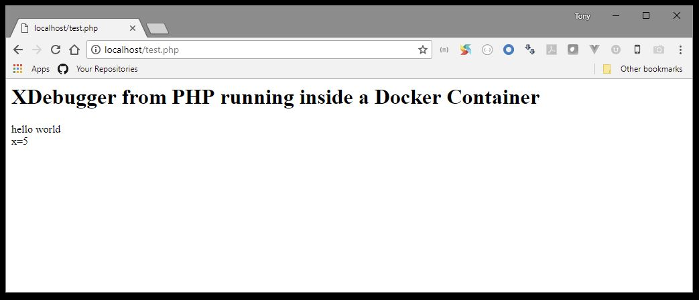
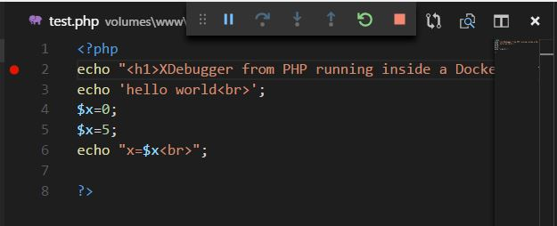
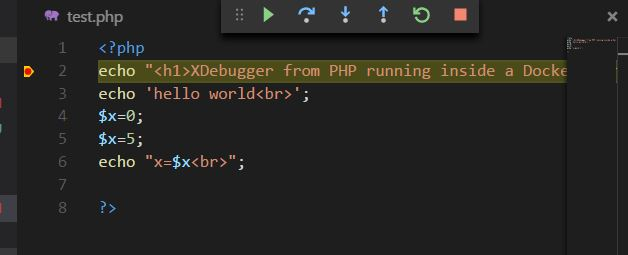

# docker-nginx-php
Simple PHP7 Docker Compose Environment


## Running
Build and start everything.
```sh
docker-compose up -d --build
```

Point your browsers to localhost:



Now start Visual Code Studio and launch the Debugger:


Click Listen for XDebug:


Set a breakpoint:



Refresh browser. This will cause the PHP code to run which will send a message to VS Code studio on port 9000, causing execution to stop at the break-point.





## Command Line
Connect to container with bash.
```sh
docker-compose exec web bash
```


## Mysql Command Line
```sh
docker-compose exec db bash
mysql --user=test --password=test test
mysql> exit
root@8792ae92e4f8:/# exit
```