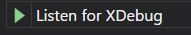

# docker-nginx-php
Simple PHP7 Docker Compose Environment to use as a starting point.  This is morphing into more than PHP7.

Goals:
* nginx as a web server
* nginx as a reverse proxy
* nginx supporting PHP
* php with XDebug, Microsoft Visual Code Studio
* mysql with a persistance using a volume
* node.js server example
* json-server example
* mongodb
* redis

## Running
Build and start everything.
```sh
docker-compose up -d --build
```

## Docker

[Docker Official Documentation](https://docs.docker.com/)


## nginx

[NGINX Official Documentation](https://nginx.org/en/docs/)

Connect to container with bash.
```sh
docker-compose exec web bash
```
[How to examine Docker logs](https://docs.docker.com/config/containers/logging/)

## php7 through nginx FastCGI Proxying 

## (nginx) static web server


## jason-server

## node.js

[NodeJS Official Documentation](https://nodejs.org/en/)

## mysql


## Debugging PHP from MicroSoft Visual Code Studio

Point your browsers to localhost:


Now start Visual Code Studio and launch the Debugger:


Click Listen for XDebug:



Set a breakpoint:


Refresh browser. This will cause the PHP code to run which will send a message to VS Code studio on port 9000, causing execution to stop at the break-point.


## Mysql Command Line
```sh
docker-compose exec db bash
mysql --user=test --password=test test
mysql> exit
root@8792ae92e4f8:/# exit
```

docker-compose exec json-server bash

